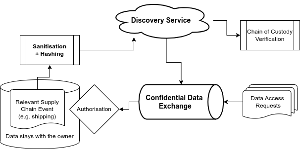

# EPCIS Sanitisation Prototype

[](https://github.com/RalphTro/epcis-event-hash-generator/actions?query=workflow%3A%22Unit+Tests%22)
[](https://github.com/RalphTro/epcis-event-hash-generator/actions?query=workflow%3A%22Code+Style%22)

This repository is part of a collaborative approach to solve the discovery problem and related read rights management of
distributed EPCIS repositories. It hosts conceptual documents and prototypical implementations of tools to hide (
sanitise and hash) EPCIS event data, share the concealed information through a discovery service and enable zero-trust
and perfectly data-owner privacy preserving read acces grants through a confidential data exchange.



The EPCIS document parsing and hashing functionality of this project is imported
from https://github.com/RalphTro/epcis-event-hash-generator. See there for details.

## Background

Supply chain traceability systems have become central in many industries, such as electronics, apparel, food and
pharmaceuticals. However, traceability data is often highly commercial sensitive, and firms seek to keep it confidential
to protect their competitive advantage. This is at odds with calls for greater transparency that would, for example,
enable product passports to enhance reusability and recyclability of products or data-based product specific CO2
footprint calculations. Therefore, a solution to this conflict of interest known as the discovery problem is needed.

This software prototype provides a vital building block to accomplish this goal in sanitising (stripping off dispensable
data) and hashing such sensitive traceability data (formatted as EPCIS events). Thereby, it enables interested parties
to investigate and demonstrate that sanitised data can be used to confirm the authenticity of products and provide a
basis for anonymously verifying the rights of an actor to access detailed traceability data.

## Algorithm

The sanitisation and hashing is configured through a simple python dictionary. See [__
init__.py](epcis_sanitiser/__init__.py) for the default example. From the EPCIS event data, we extract only the fields
with names given by the dictionary keys and

- Include the field and value in clear text if the dict value is `None`
- Include the field with the value concatenated with the dict value and then hashed otherwise

Hashes are expressed as named identifiers (NI) according to [RFC6920](https://datatracker.ietf.org/doc/html/rfc6920).

If a field of an EPCIS event has a `type`, this type is included as a query parameter to the NI with its value in clear
text, since this type might be essential for chain of custody tracking.

### Example

For example, specifying `"bizStep": None,` in the configuration means that the `bizStep` field of the EPCIS event will
be included in clear text.
`"sourceList": "urn:epc:id:gdti:0614141.00002.PO-123"` in the configuration means that all fields in the source list of
an EPCIS event will be salted with the given string (here an accidentally shared secret in form of an invoice ID) and
then hashed. If only these two fields are configured the event

```xml
<ObjectEvent>
    <eventTime>2021-04-28T00:00:00.000+02:00</eventTime>
    <eventTimeZoneOffset>+02:00</eventTimeZoneOffset>
    <epcList>
        <epc>urn:epc:id:sscc:4023333.0222222222</epc>
    </epcList>
    <action>OBSERVE</action>
    <bizStep>urn:epcglobal:cbv:bizstep:shipping</bizStep>
    <disposition>urn:epcglobal:cbv:disp:in_transit</disposition>
    <readPoint>
        <id>urn:epc:id:sgln:4023333.00002.0</id>
    </readPoint>
    <bizTransactionList>
        <bizTransaction type="urn:epcglobal:cbv:btt:po">urn:epc:id:gdti:0614141.00002.PO-123</bizTransaction>
    </bizTransactionList>
    <extension>
        <sourceList>
            <source type="urn:epcglobal:cbv:sdt:possessing_party">urn:epc:id:pgln:4023333.00000</source>
        </sourceList>
        <destinationList>
            <destination type="urn:epcglobal:cbv:sdt:possessing_party">urn:epc:id:pgln:0614141.00000</destination>
        </destinationList>
    </extension>
</ObjectEvent>
```

would be concealed as

```json
{
  "bizStep": "urn:epcglobal:cbv:bizstep:shipping",
  "sourceList": [
    "ni:///sha-256;63ba4ead93f79fb67e68a277e85247988fb410ac0c2f00b87f802d75031b52f9?type=urn:epcglobal:cbv:sdt:possessing_party"
  ]
}
```

since `63ba4ead93f79fb67e68a277e85247988fb410ac0c2f00b87f802d75031b52f9` is the sha256 hash (in hexadecimal
representation) of `urn:epc:id:pgln:0614141.00000urn:epc:id:gdti:0614141.00002.PO-123`.

## Web Service Usage

Start the web service like

```
epcis_sanitiser/webservice.py -p 8000
```

Run with `-h` for usage information.

Instances of those webservices for demo/testing purposes are running at

- https://discovery.epcat.de/docs
- https://discovery.epcat.de/dead_drop/docs

Note that these demo services may wipe there database or be unavaiable any time. Do not use beyond ad hoc testing.

### Example POST an EPCIS event in XML format to be sanitised, hashed and stored in the discovery service

```bash
curl -X 'POST' \
  'https://discovery.epcat.de/sanitise_xml_event/' \
  -H 'accept: application/json' \
  -H 'Content-Type: application/json' \
  -d '<?xml version="1.0" ?> <epcis:EPCISDocument xmlns:epcis="urn:epcglobal:epcis:xsd:1"   xmlns:https="https://ns.example.com/epcis"    xmlns:example="https://ns.example.com/epcis" schemaVersion="1.2" creationDate="2020-03-03T13:07:51.709Z">    <EPCISBody>        <EventList>            <ObjectEvent>                <eventTime>2020-03-04T11:00:30.000+01:00</eventTime>                <recordTime>2020-03-04T11:00:30.999+01:00</recordTime>                <eventTimeZoneOffset>+01:00</eventTimeZoneOffset>                <epcList>                    <epc>urn:epc:id:sscc:4012345.0000000333</epc>                    <epc>urn:epc:id:sscc:4012345.0000000111</epc>                    <epc>urn:epc:id:sscc:4012345.0000000222</epc>                </epcList>                <action>OBSERVE</action>                <bizStep>urn:epcglobal:cbv:bizstep:departing</bizStep>                <readPoint>                    <id>urn:epc:id:sgln:4012345.00011.987</id>                </readPoint>                <example:myField1>                    <example:mySubField1>2</example:mySubField1>                    <example:mySubField2>5</example:mySubField2>                </example:myField1>                <https:myField2>0</https:myField2>                <https:myField3>                    <example:mySubField3>3</example:mySubField3>                    <example:mySubField3>1</example:mySubField3>                </https:myField3>            </ObjectEvent>        </EventList>    </EPCISBody></epcis:EPCISDocument>' | jq
```

This call will return

```json
{
  "sanitised_events": [
    {
      "request_event_data_at": "https://discovery.epcat.de/dead_drop",
      "eventType": "ObjectEvent",
      "eventId": "ni:///sha-256;8b089483649d983ea03cfc8d6743beba644eb1cfb5bfc654ec8484a98263c901",
      "eventTime": "2020-03-04T11:00:30.000+01:00",
      "action": "OBSERVE",
      "epcList": [
        "ni:///sha-256;1ac005312f9635d448b8ccb7a45f8bba8cccd257025aa06cd1f6445f79cb957c",
        "ni:///sha-256;e855ce4446a9726fed412e6e1f58632666917427ea9ed4b43ac4d7dc67a0f135",
        "ni:///sha-256;a230ea36d082a729adfb341f4e9cbe48b825c36c9a7bb39e3543b79afe8f874a"
      ],
      "bizStep": "urn:epcglobal:cbv:bizstep:departing"
    }
  ]
}
```

#### Query

After POSTing the event, the concealed data is publicly avaiable and can be found by querying for the event ID (if
known)

```bash
curl 'https://discovery.epcat.de/event/sha-256;8b089483649d983ea03cfc8d6743beba644eb1cfb5bfc654ec8484a98263c901' | jq
```

or for the hashed EPC (which is the more relevant use case)

```bash
curl 'https://discovery.epcat.de/events_for_epc/sha-256;1ac005312f9635d448b8ccb7a45f8bba8cccd257025aa06cd1f6445f79cb957c' | jq
```

Both calls will return the same data as the post together with and any other concealed events matching the query.

### POST an EPCIS event in JSON format

The algorithm presented here is about transforming the data, not about the particular serialization. It works the same
way for the new (EPCIS 2.0) JSON (-LD) format as for the XML format.

```bash
curl -X 'POST' \
  'https://discovery.epcat.de/sanitise_json_event/' \
  -H 'accept: application/json' \
  -H 'Content-Type: application/json' \
  -d '{
  "@context": "https://id.gs1.org/epcis-context.jsonld",
  "isA": "EPCISDocument",
  "creationDate": "2020-03-03T13:07:51.709+00:00",
  "schemaVersion": 1.2,
  "format": "application/ld+json",
  "epcisBody": {
    "eventList": [
      {
        "isA": "ObjectEvent",
        "eventTime": "2020-03-04T11:00:30.000+01:00",
        "eventTimeZoneOffset": "+01:00",
        "recordTime": "2020-03-04T11:00:30.999+01:00",
        "epcList": [
          "urn:epc:id:sscc:4012345.0000000333",
          "urn:epc:id:sscc:4012345.0000000111",
          "urn:epc:id:sscc:4012345.0000000222"
        ],
        "action": "OBSERVE",
        "bizStep": "urn:epcglobal:cbv:bizstep:departing",
        "readPoint": {"id": "urn:epc:id:sgln:4012345.00011.987"},
        "example:myField1": {
          "@xmlns:example": "https://ns.example.com/epcis",
          "example:mySubField1": "2",
          "example:mySubField2": "5"
        },
        "example:myField2": {
          "@xmlns:example": "https://ns.example.com/epcis",
          "#text": "0"
        },
        "example:myField3": {
          "@xmlns:example": "https://ns.example.com/epcis",
          "example:mySubField3": [
            "3",
            "1"
          ]
        }
      }
    ]
  }
}' | jq
```

## CLI Usage

Run the CLI like

```
epcis_sanitiser/__main__.py tests/events/ReferenceEventHashAlgorithm.xml
```

Run with `-h` for usage information.

## License

Copyright (c) 2020-2022 GS1 Germany, European EPC Competence Center GmbH (EECC)

Permission is hereby granted, free of charge, to any person obtaining a copy of this software and associated
documentation files (the "Software"), to deal in the Software without restriction, including without limitation the
rights to use, copy, modify, merge, publish, distribute, sublicense, and/or sell copies of the Software, and to permit
persons to whom the Software is furnished to do so, subject to the following conditions:

The above copyright notice and this permission notice shall be included in all copies or substantial portions of the
Software.

THE SOFTWARE IS PROVIDED "AS IS", WITHOUT WARRANTY OF ANY KIND, EXPRESS OR IMPLIED, INCLUDING BUT NOT LIMITED TO THE
WARRANTIES OF MERCHANTABILITY, FITNESS FOR A PARTICULAR PURPOSE AND NONINFRINGEMENT. IN NO EVENT SHALL THE AUTHORS OR
COPYRIGHT HOLDERS BE LIABLE FOR ANY CLAIM, DAMAGES OR OTHER LIABILITY, WHETHER IN AN ACTION OF CONTRACT, TORT OR
OTHERWISE, ARISING FROM, OUT OF OR IN CONNECTION WITH THE SOFTWARE OR THE USE OR OTHER DEALINGS IN THE SOFTWARE.
