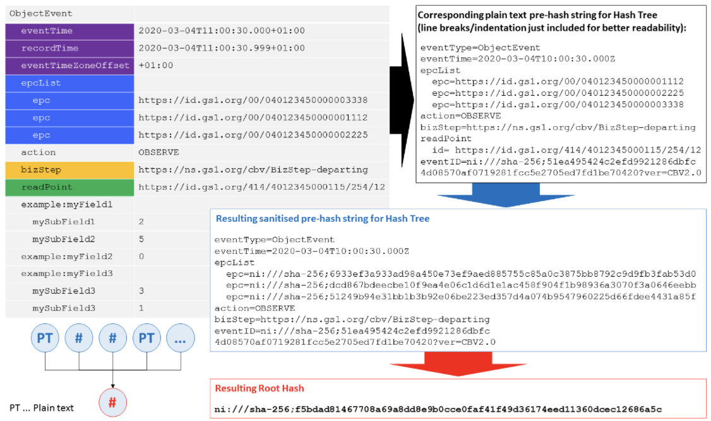

= A solution approach for the anonymous sharing of sensitive supply chain traceability data
Rob Glew <rg522@cam.ac.uk>; Ralph Tröger <ralph.troeger@gs1.de>; Sebastian Schmitter <sebastian.schmittner@eecc.de>
Appendix
:doctype: article
:icons: font
:title-page:
:homepage: https://github.com/european-epc-competence-center/epcis-sanitisation
:xrefstyle: short
:imagesdir: ./
:listing-caption: Listing

== Appendix

=== Sanitisation Schematic

In the sanitisation process, all unnecessary data is removed from the event and then any identifiable or possibly sensitive information is obfuscated by hashing. Hashed data is formatted according to https://datatracker.ietf.org/doc/html/rfc6920[RFC6920], i.e. a prefix like “ni://sha-256;” indicates the hashing algorithm (here sha-256). The sanitised and hashed event data is then published through the discovery service, with anyone able to see it but unable to extract sensitive information.

[[Layers]]
.Example for an EPCIS event being sanitised (black arrow) and hashed (blue arrow)

==== Example of a Full EPCIS Shipping Event
Figures A2 and A3 show the sanitisation process for a shipping event.

[[ShippingEvent]]
.Example for an EPCIS shipping event
[source,xml]
----
<ObjectEvent>
    <eventTime>2021-04-28T00:00:00.000+02:00</eventTime>
    <eventTimeZoneOffset>+02:00</eventTimeZoneOffset>
    <epcList>
        <epc>urn:epc:id:sscc:4023333.0222222222</epc>
    </epcList>
    <action>OBSERVE</action>
    <bizStep>urn:epcglobal:cbv:bizstep:shipping</bizStep>
    <disposition>urn:epcglobal:cbv:disp:in_transit</disposition>
    <readPoint>
        <id>urn:epc:id:sgln:4023333.00002.0</id>
    </readPoint>
    <bizTransactionList>
        <bizTransaction type="urn:epcglobal:cbv:btt:po">
            urn:epc:id:gdti:0614141.00002.PO-123
        </bizTransaction>
    </bizTransactionList>
    <extension>
        <sourceList>
            <source type="urn:epcglobal:cbv:sdt:possessing_party">
                urn:epc:id:pgln:4023333.00000
            </source>
        </sourceList>
        <destinationList>
            <destination type="urn:epcglobal:cbv:sdt:possessing_party">
                urn:epc:id:pgln:0614141.00000
            </destination>
        </destinationList>
    </extension>
</ObjectEvent>
----

[[SanitisedShippingEvent]]
.Santised <<ShippingEvent>> showing the 'request data at' deap drop solution
[source,json]
----
{
  "request_event_data_at": "https://discovery.epcat.de/dead_drop",
  "eventType": "ObjectEvent",
  "eventId": "ni:///sha-256;be2ee5fb9e2bcf3a7dd249328dc4dc832e68c4a456ff27a979a4c7a6b418f1db",
  "eventTime": "2021-04-28T00:00:00.000+02:00",
  "action": "OBSERVE",
  "epcList": [
    "ni:///sha-256;5e2949760784f50fcda3ce1d5ec4cc255818e252f9fddbd0b9f39d6b00038191"
  ],
  "bizStep": "urn:epcglobal:cbv:bizstep:shipping",
  "sourceList": [
    "ni:///sha-256;704051f07e24e6d37d6ca3990f116d6139c2486334e854f671e12cf91927be85?type=urn:epcglobal:cbv:sdt:possessing_party"
  ],
  "destinationList": [
    "ni:///sha-256;25260d4d220cbfa5876fd92f81450e4ed86d272a54ffb1bcea1c49b636b9f4de?type=urn:epcglobal:cbv:sdt:possessing_party"
  ],
  "bizTransactionList": [
    "ni:///sha-256;c2999291cefed0b533270ab41e40730aee95fadecc7545d5c67e3536a66fc0da?type=urn:epcglobal:cbv:btt:po"
  ]
}
----

[[ReceivingEvent]]
.Example for an EPCIS receiving event
[source,xml]
----
<ObjectEvent>
    <eventTime>2021-04-29T00:00:00.000+02:00</eventTime>
    <eventTimeZoneOffset>+02:00</eventTimeZoneOffset>
    <epcList>
        <epc>urn:epc:id:sscc:4023333.0222222222</epc>
    </epcList>
    <action>OBSERVE</action>
    <bizStep>urn:epcglobal:cbv:bizstep:receiving</bizStep>
    <disposition>urn:epcglobal:cbv:disp:in_progress</disposition>
    <readPoint>
        <id>urn:epc:id:sgln:0614141.00012.0</id>
    </readPoint>
    <bizTransactionList>
        <bizTransaction type="urn:epcglobal:cbv:btt:po">
            urn:epc:id:gdti:0614141.00002.PO-123
        </bizTransaction>
    </bizTransactionList>
    <extension>
        <sourceList>
            <source type="urn:epcglobal:cbv:sdt:possessing_party">
                urn:epc:id:pgln:4023333.00000
            </source>
        </sourceList>
        <destinationList>
            <destination type="urn:epcglobal:cbv:sdt:possessing_party">
                urn:epc:id:pgln:0614141.00000
            </destination>
        </destinationList>
    </extension>
</ObjectEvent>
----

[[SanitisedShippingEvent]]
.Santised <<ReceivingEvent>>
[source,json]
----
{
  "request_event_data_at": "https://discovery.epcat.de/dead_drop",
  "eventType": "ObjectEvent",
  "eventId": "ni:///sha-256;0d9c15bb90773ee113466affa42903f5d8fcbf15edae4c0833d1e549699d5d7d",
  "eventTime": "2021-04-29T00:00:00.000+02:00",
  "action": "OBSERVE",
  "epcList": [
    "ni:///sha-256;5e2949760784f50fcda3ce1d5ec4cc255818e252f9fddbd0b9f39d6b00038191"
  ],
  "bizStep": "urn:epcglobal:cbv:bizstep:receiving",
  "sourceList": [
    "ni:///sha-256;704051f07e24e6d37d6ca3990f116d6139c2486334e854f671e12cf91927be85?type=urn:epcglobal:cbv:sdt:possessing_party"
  ],
  "destinationList": [
    "ni:///sha-256;25260d4d220cbfa5876fd92f81450e4ed86d272a54ffb1bcea1c49b636b9f4de?type=urn:epcglobal:cbv:sdt:possessing_party"
  ],
  "bizTransactionList": [
    "ni:///sha-256;c2999291cefed0b533270ab41e40730aee95fadecc7545d5c67e3536a66fc0da?type=urn:epcglobal:cbv:btt:po"
  ]
}
----

