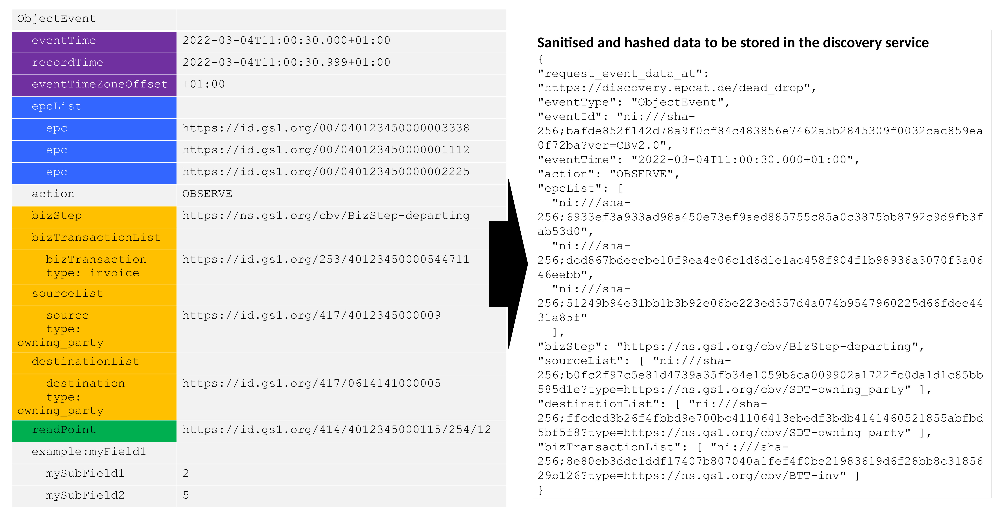
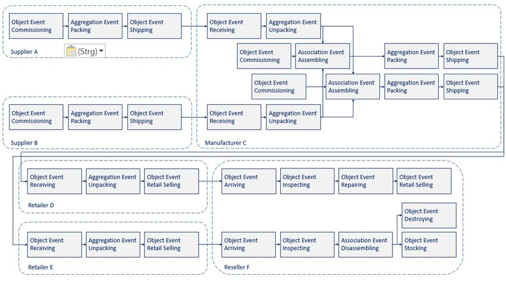

= A solution approach for the anonymous sharing of sensitive supply chain traceability data - Appendix
Rob Glew <rg522@cam.ac.uk>; Ralph Tröger <ralph.troeger@gs1.de>; Sebastian Schmitter <sebastian.schmittner@eecc.de>
:doctype: article
:icons: font
:title-page:
:homepage: https://github.com/european-epc-competence-center/epcis-sanitisation
:xrefstyle: short
:imagesdir: ./
:listing-caption: Code Block

== Sanitisation and Hashing of Example Events

In the sanitisation process, all unnecessary data is removed from the event and then any identifiable or possibly sensitive information is obfuscated by hashing. Hashed data is formatted according to https://datatracker.ietf.org/doc/html/rfc6920[RFC6920], i.e. a prefix like “ni://sha-256;” indicates the hashing algorithm (here sha-256). The sanitised and hashed event data is then published through the discovery service, with anyone able to see it but unable to extract sensitive information.

=== Graphical Example

[[Sanitisation]]
.Graphical Example for an EPCIS event being sanitised and hashed

<<Sanitisation>> is a graphical representatoin of an example EPCIS event available at
https://github.com/european-epc-competence-center/epcis-sanitisation/blob/master/tests/events/ReferenceEventHashAlgorithm.xml
and the sanitised and hashed discovery data for this event, avaiable at 
https://github.com/european-epc-competence-center/epcis-sanitisation/blob/master/tests/events/ReferenceEventHashAlgorithm.sanitised.json .

<<<

=== Chain Navigation

[[FullChain]]
.Depiction of a supply chain segment

The EPCIS events for the ficticious but realistic supply chin segment shown in <<FullChain>> are avaiable in full at 
https://github.com/european-epc-competence-center/epcis-sanitisation/blob/master/tests/events/SanitisationEventDataset.xml
with the discovery data at
https://github.com/european-epc-competence-center/epcis-sanitisation/blob/master/tests/events/SanitisationEventDataset.sanitised.json

We will focus on one step in this chain, naemyl the first shipping and receiving event in order to exemplyfy the chain navigation.
The code snippets shown below are taken from the above mentioned larger files.

<<<

==== Shipping Event
<<ShippingEvent>> shows a full EPCIS shipping event and <<SanitisedShippingEvent>> the corresponding sanitised and hashed data.

[[ShippingEvent]]
.Example for an EPCIS shipping event
[source,xml]
----
<ObjectEvent>
    <eventTime>2021-04-28T00:00:00.000+02:00</eventTime>
    <eventTimeZoneOffset>+02:00</eventTimeZoneOffset>
    <epcList>
        <epc>urn:epc:id:sscc:4023333.0222222222</epc>
    </epcList>
    <action>OBSERVE</action>
    <bizStep>urn:epcglobal:cbv:bizstep:shipping</bizStep>
    <disposition>urn:epcglobal:cbv:disp:in_transit</disposition>
    <readPoint>
        <id>urn:epc:id:sgln:4023333.00002.0</id>
    </readPoint>
    <bizTransactionList>
        <bizTransaction type="urn:epcglobal:cbv:btt:po">
            urn:epc:id:gdti:0614141.00002.PO-123
        </bizTransaction>
    </bizTransactionList>
    <extension>
        <sourceList>
            <source type="urn:epcglobal:cbv:sdt:possessing_party">
                urn:epc:id:pgln:4023333.00000
            </source>
        </sourceList>
        <destinationList>
            <destination type="urn:epcglobal:cbv:sdt:possessing_party">
                urn:epc:id:pgln:0614141.00000
            </destination>
        </destinationList>
    </extension>
</ObjectEvent>
----

[[SanitisedShippingEvent]]
.The santised and hashed event from <<ShippingEvent>>. Also exemplifies the 'request data at' deap drop solution
[source,json]
----
{
    "request_event_data_at": "https://discovery.epcat.de/dead_drop",
    "eventType": "ObjectEvent",
    "eventId": "ni:///sha-256;8cc07dab5f2b6674fd3d892a36c9795846cad9d169bbc2d48a50cd0156c2ec41?ver=CBV2.0",
    "eventTime": "2021-04-28T00:00:00.000+02:00",
    "action": "OBSERVE",
    "epcList": [
        "ni:///sha-256;e5284a01b67b7756c0f51d10e7c74c6f277fea0e1f08ebe8f27fae25b04e695b"
    ],
    "bizStep": "urn:epcglobal:cbv:bizstep:shipping",
    "sourceList": [
        "ni:///sha-256;63ba4ead93f79fb67e68a277e85247988fb410ac0c2f00b87f802d75031b52f9?type=urn:epcglobal:cbv:sdt:possessing_party"
    ],
    "destinationList": [
        "ni:///sha-256;8d2cdc63d2e3d173174c9167ac4a857dfc0a0abba7cee54ef0e4b9a21156021b?type=urn:epcglobal:cbv:sdt:possessing_party"
    ],
    "bizTransactionList": [
        "ni:///sha-256;2428dd1fddb2811d950320b732dda8f4be7312e02be14c2dfb8da9969085da38?type=urn:epcglobal:cbv:btt:po"
    ]
}
----

<<<

==== Receiving Event

<<ReceivingEvent>> shows a full EPCIS shipping event and <<SanitisedReceivingEvent>> the corresponding sanitised and hashed data.

[[ReceivingEvent]]
.Example for an EPCIS receiving event
[source,xml]
----
<ObjectEvent>
    <eventTime>2021-04-29T00:00:00.000+02:00</eventTime>
    <eventTimeZoneOffset>+02:00</eventTimeZoneOffset>
    <epcList>
        <epc>urn:epc:id:sscc:4023333.0222222222</epc>
    </epcList>
    <action>OBSERVE</action>
    <bizStep>urn:epcglobal:cbv:bizstep:receiving</bizStep>
    <disposition>urn:epcglobal:cbv:disp:in_progress</disposition>
    <readPoint>
        <id>urn:epc:id:sgln:0614141.00012.0</id>
    </readPoint>
    <bizTransactionList>
        <bizTransaction type="urn:epcglobal:cbv:btt:po">
            urn:epc:id:gdti:0614141.00002.PO-123
        </bizTransaction>
    </bizTransactionList>
    <extension>
        <sourceList>
            <source type="urn:epcglobal:cbv:sdt:possessing_party">
                urn:epc:id:pgln:4023333.00000
            </source>
        </sourceList>
        <destinationList>
            <destination type="urn:epcglobal:cbv:sdt:possessing_party">
                urn:epc:id:pgln:0614141.00000
            </destination>
        </destinationList>
    </extension>
</ObjectEvent>
----

[[SanitisedReceivingEvent]]
.The santised and hashed event from <<ReceivingEvent>>
[source,json]
----
{
    "request_event_data_at": "https://discovery.epcat.de/dead_drop",
    "eventType": "ObjectEvent",
    "eventId": "ni:///sha-256;7a742a2be1d9c5cc71bda8d58abc93393236e54deca8b5d1672acc8022d6ec34?ver=CBV2.0",
    "eventTime": "2021-04-29T00:00:00.000+02:00",
    "action": "OBSERVE",
    "epcList": [
        "ni:///sha-256;e5284a01b67b7756c0f51d10e7c74c6f277fea0e1f08ebe8f27fae25b04e695b"
    ],
    "bizStep": "urn:epcglobal:cbv:bizstep:receiving",
    "sourceList": [
        "ni:///sha-256;63ba4ead93f79fb67e68a277e85247988fb410ac0c2f00b87f802d75031b52f9?type=urn:epcglobal:cbv:sdt:possessing_party"
    ],
    "destinationList": [
        "ni:///sha-256;8d2cdc63d2e3d173174c9167ac4a857dfc0a0abba7cee54ef0e4b9a21156021b?type=urn:epcglobal:cbv:sdt:possessing_party"
    ],
    "bizTransactionList": [
        "ni:///sha-256;2428dd1fddb2811d950320b732dda8f4be7312e02be14c2dfb8da9969085da38?type=urn:epcglobal:cbv:btt:po"
    ]
}
----

==== Linking the Chain

The sanitised and hashed data in the above examples <<SanitisedShippingEvent>> and <<SanitisedReceivingEvent>> is shared through the Discovery Service.
Anyone who wants to obtain information about the shipment with the id `urn:epc:id:sscc:4023333.0222222222` (see <<ShippingEvent>>) can now
hash the id with standard tools like `echo -n "urn:epc:id:sscc:4023333.0222222222"|sha256sum` to obtain the hex encoded sha256 hash `e5284a01b67b7756c0f51d10e7c74c6f277fea0e1f08ebe8f27fae25b04e695b` and query the discovery service to obtain the data sets <<SanitisedShippingEvent>> and <<SanitisedReceivingEvent>>.
From these dataset it can be verified that there are matching shipping and receiving IDs of parties with type `posessing_party`. This enables to establish an anonymous chain of custody.

==== Zero Trust Clear Text Exchange

Using the `request_event_data_at` url pointing to the confidential data echange service, anyone can post a request for more information. The data owner may then regularly query for such requests, decide on their legitimacy, and provide all or some clear text information from the original event to the querying party if authorised.

If the data owner finds a request to be insufficiently authorized, he can just ignore the request, which will then time out. This ensures that no information what so ever about the data owner or any of the parties involved in the business transactions is revealed.

